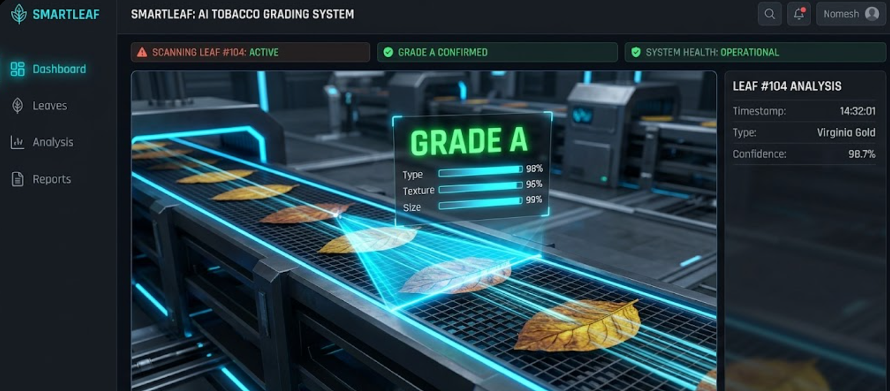
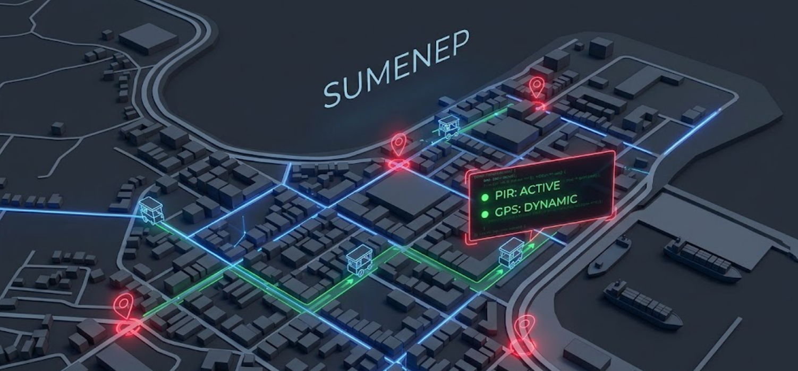
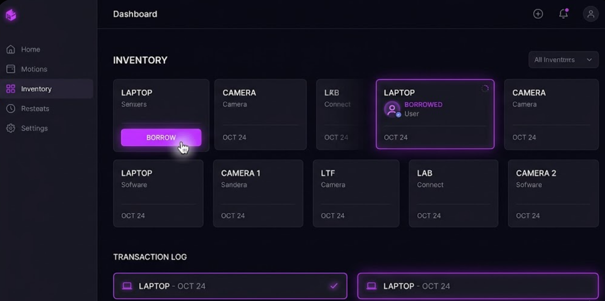
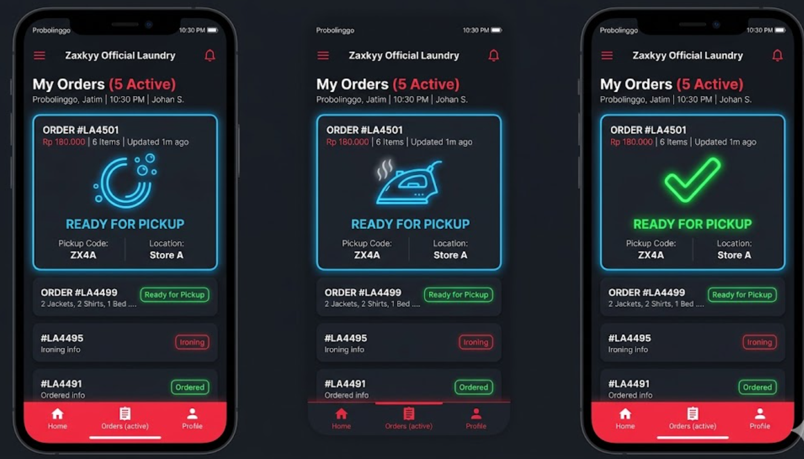

  
    
  
  

  
<b>Full-Stack Development | Artificial Intelligence | Internet of Things</b>

  
    

  
  
  
  
  

---

### 💫 About Me
Welcome to my GitHub! I am an AI Engineer Cohort, IoT Enthusiast, and Founder of Zaxkyy Software House based in Indonesia. I specialize in bridging the gap between hardware and software, integrating AI and IoT into robust, scalable web applications.

- 🔭 **Currently Working On:** Scaling **Zaxkyy Software House** and building advanced AI-driven dashboards.
- 🌱 **Currently Learning:** Advanced Deep Learning architectures and Cloud Deployment (AWS/GCP).
- 👯 **Looking to Collaborate On:** Open-source AI projects, IoT innovations, and freelance web development.
- ⚡ **Fun Fact:** Aside from coding, I am an E-Learning content creator and an active stock market investor.

 

  

 

### 💼 What I Do (Services)
As a technical lead and founder, I provide end-to-end solutions:
* **Custom Web Application:** Building responsive, secure, and fast websites (Laravel, React, Node.js).
* **AI & Computer Vision Integration:** Adding intelligence to your apps (Predictive analysis, image classification).
* **IoT Solutions:** Smart hardware integration (ESP32, sensor monitoring) connected to cloud dashboards.
* **UI/UX & Branding:** Designing intuitive interfaces and branding materials for startups and businesses.

---

### 🎓 Experience & Achievements
- 🧠 **AI Engineer Cohort Certification** - Intensive AI training program by Dicoding Indonesia & IBM SkillsBuild.
- 👨‍💻 **Organizing Committee / Core Team** - Google Developer Groups (GDG) PENS campus.
- 🌐 **Google Student Ambassador 2026** - Active participant in tech advocacy and global challenges.
- 💼 **Founder & Lead Developer** - Zaxkyy Software House.

---

### 🚀 Featured Projects

> 💡 *Click on the project titles to view the repositories. See the systems in action below!*

| Project Overview | Preview (UI/Dashboard) |
| :--- | :---: |
| **🌿 [SmartLeaf Tobacco Grader](https://github.com/ZaxkyyOfficial)**    Sistem cerdas berbasis AI untuk mengklasifikasikan dan menilai kualitas daun tembakau secara otomatis menggunakan *Computer Vision*.    **Tech Stack:** `Python` `TensorFlow/Keras` `OpenCV` `Flask` |  |
| **📡 [SmartPKL (IoT Monitoring)](https://github.com/ZaxkyyOfficial)**    Sistem monitoring Pedagang Kaki Lima (PKL) terintegrasi untuk BRIDA Sumenep dengan pelacakan *real-time*.    **Tech Stack:** `C/C++` `ESP32` `PIR & GPS` `Node.js` |  |
| **🚗 [AI Smart Parking Booking](https://github.com/ZaxkyyOfficial)**    Smart parking booking platform with real-time occupancy prediction and integrated IoT sensors.    **Tech Stack:** `React.js` `Node.js` `Python (AI/ML)` `ESP32` |  |
| **📦 [INVENAPP Inventory Manager](https://github.com/ZaxkyyOfficial)**    Responsive web application for comprehensive asset tracking, lending, and returns.    **Tech Stack:** `Laravel/PHP` `MySQL` `Bootstrap` |  |
| **👕 [WashApp Laundry Service](https://github.com/ZaxkyyOfficial)**    Admin dashboard and user client app for a complete digital laundry management service.    **Tech Stack:** `Vue.js` `Laravel` `MySQL` `TailwindCSS` |  |

---

### 📝 Latest Articles & E-Learning Updates

* 📘 *Coming Soon:* **[E-Book] Panduan Praktis AI & IoT untuk Developer Pemula**
* 💻 *Coming Soon:* **Mendeploy Model Computer Vision dengan Flask & React**
* 💡 *Coming Soon:* **Tips UI/UX Modern untuk Aplikasi Manajemen Skala Besar**
> *I frequently share tutorials, code snippets, and tech insights. Stay tuned!*

---

### 🛠️ Tech Stack & Tools

**Full-Stack (Languages)**  
      

**Frontend**  
      

**Backend & Databases**  
     

**AI, IoT & Operations**  
      

**BAAS & Design Tools**  
     

---

### 🌐 Let's build something amazing together! 🚀
Feel free to reach out for freelance projects, open-source collaborations, or just a quick chat.

  
  

  <b>Find my content useful? Consider supporting my work:</b>  
  
  

---

  <i>Git History Snake Animation</i> 
  

---
